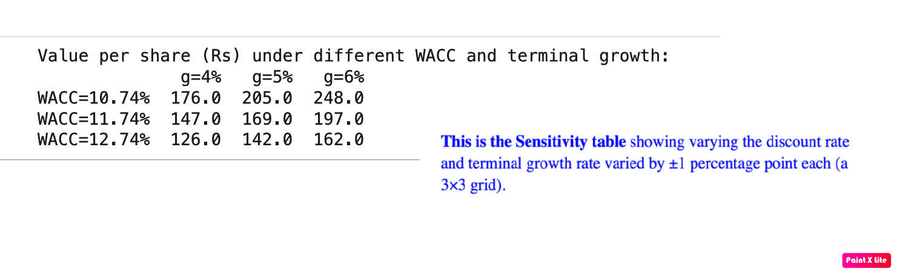
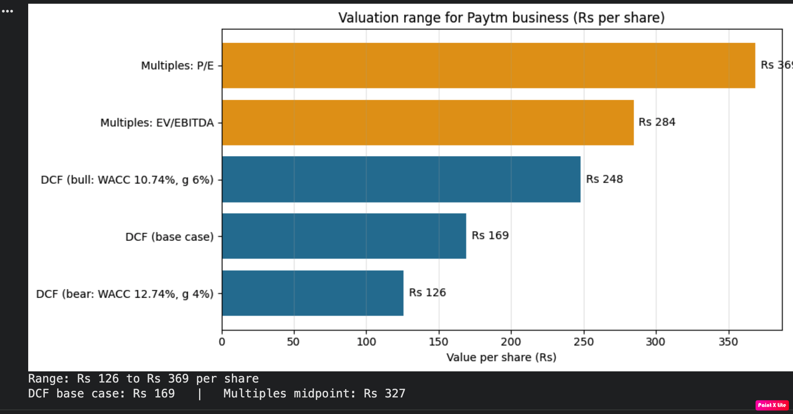

# BitSoM Capstone Part 3 — AI-Augmented FinTech Advisory & Blockchain Risk

This section is for all the files for Part 3 of the capstone assignment.

## Included Files

### Part D — DCF Valuation Calculator

For the Paytm business valuation, refer to [`dcf_calculator.ipynb`](./dcf_calculator.ipynb) in this folder. It contains calculations for valuing the Paytm business using two methods:

- CAPM and DCF (intrinsic valuation)
- Peer multiples

I have made assumptions for the Paytm business financials in [`financials_summary.csv`](./financials_summary.csv). Other assumptions are available in [`dcf_assumptions.csv`](./dcf_assumptions.csv) and [`dcf_growth_path.csv`](./dcf_growth_path.csv).

Sensitivity table (3 × 3 grid):

comment in 2–3 sentences on how the two estimates compare:

Notice that the DCF (intrinsic) valuation method, using the time value of money and CAPM equation, produces more conservative valuation results. DCF assumes fading growth and heavy CapEx, while the peer-multiples method is only as good as the comparisons, and the peers could trade at premium multiples.

It is a good idea not to estimate just a single valuation figure, but to look at a range of figures using different assumptions and sensitivities for bear, bull, and multiples cases, as the market is sensitive to different conditions.

For exact Valuation numbers, refer to [`dcf_calculator.ipynb`](./dcf_calculator.ipynb) or the [`dcf_calculator.py`](./dcf_calculator.py) code. Here is the screenshot.

### Part E — Blockchain/Crypto Risk-Analysis Appendix

See [`blockchain_risk_note.md`](./blockchain_risk_note.md) for the complete Part E appendix.
