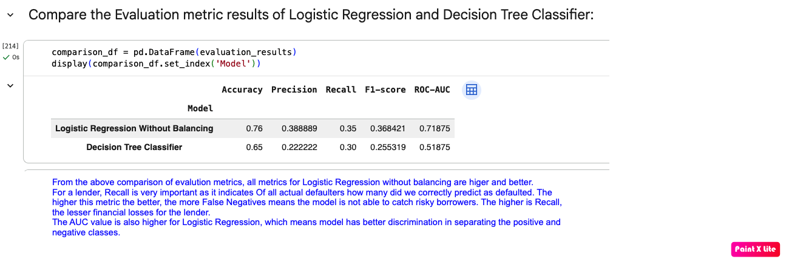
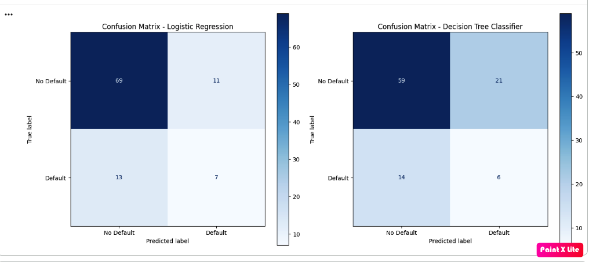
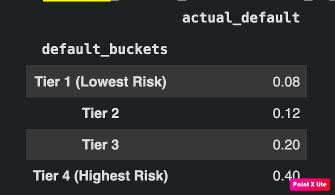

# BitSoM Capstone Part 2 — Credit Risk & Lending ML

This section contains all files for Part 2 of the capstone assignment. It covers credit-risk exploratory analysis, thin-file handling, classification models, risk-based pricing, transaction anomaly detection, bias awareness, and the final model recommendation.

## Included files

| File or folder | Purpose |
|---|---|
| [`data/generate_data.py`](data/generate_data.py) | Reproducibly generates both raw CSV datasets. |
| [`data/credit_applicants.csv`](data/credit_applicants.csv) | Applicant-level input data for credit-risk modelling. |
| [`data/txn_behaviour.csv`](data/txn_behaviour.csv) | Transaction-behaviour input data for anomaly detection. |
| [`Masai_Capstone_Credit_Risk_Lending_EDA.ipynb`](Masai_Capstone_Credit_Risk_Lending_EDA.ipynb) | EDA, preprocessing, classification, evaluation, and risk-based pricing notebook. |
| [`Masai_Capstone_Anomaly_detection.ipynb`](Masai_Capstone_Anomaly_detection.ipynb) | Isolation Forest anomaly-detection notebook. |
| [`requirements.txt`](requirements.txt) | Python packages required to execute and export both notebooks. |
| [`prob_applic_df.csv`](prob_applic_df.csv) | Applicants bucketed by predicted default probability and illustrative interest rate. |
| [`screenshots/`](screenshots/) | Supporting model results, confusion matrices, pricing, default-rate, and anomaly-recall images. |

<details>
<summary><strong>Build &amp; run — first-time setup and command-line execution</strong></summary>

## First-time setup and command-line execution

Run all commands from this directory so the notebooks can find their input files under `data/`. An IDE is not required.

### 1. Create and activate a virtual environment

Python 3.9 or later is supported. If `pyenv` is installed, select an available Python version first; for example:

```bash
pyenv shell 3.10.13
```

Create a new environment and install the required packages:

```bash
python3 -m venv .venv
source .venv/bin/activate
python3 -m pip install --upgrade pip
python3 -m pip install -r requirements.txt
```

Confirm that the active interpreter and Jupyter installation belong to the virtual environment:

```bash
python3 --version
python3 -m jupyter --version
```

Use `python3 -m jupyter` in the commands below. This avoids accidentally invoking Jupyter from a different `pyenv` or system Python installation.

### 2. Generate the input datasets

The generator writes the CSV files into its current directory, so run it from `data/`:

```bash
pushd data
python3 generate_data.py
popd
```

This reproducibly creates or replaces `data/credit_applicants.csv` and `data/txn_behaviour.csv`.

### 3. Execute both notebooks

The following commands run every code cell and save new notebooks containing the generated outputs. The source notebooks are not overwritten.

```bash
mkdir -p outputs

python3 -m jupyter nbconvert \
  --execute \
  --to notebook \
  --ExecutePreprocessor.timeout=600 \
  --output-dir=outputs \
  --output=Credit_Risk_Lending_EDA_executed.ipynb \
  Masai_Capstone_Credit_Risk_Lending_EDA.ipynb

python3 -m jupyter nbconvert \
  --execute \
  --to notebook \
  --ExecutePreprocessor.timeout=600 \
  --output-dir=outputs \
  --output=Anomaly_Detection_executed.ipynb \
  Masai_Capstone_Anomaly_detection.ipynb
```

Each command completes with exit status `0` when execution succeeds. Check the most recent status with `echo $?`.

### 4. Export readable HTML reports

```bash
python3 -m jupyter nbconvert \
  --to html \
  --output-dir=outputs \
  outputs/Credit_Risk_Lending_EDA_executed.ipynb

python3 -m jupyter nbconvert \
  --to html \
  --output-dir=outputs \
  outputs/Anomaly_Detection_executed.ipynb
```

The executed notebooks and HTML reports are saved in `outputs/`. List them with:

```bash
ls -lh outputs
```

### Troubleshooting

- **`pyenv: jupyter: command not found`:** activate the virtual environment and use `python3 -m jupyter` instead of the standalone `jupyter` command.
- **The virtual environment uses an unexpected Python version:** deactivate it, select the intended version with `pyenv shell <version>`, and create a new virtual environment.
- **`MathBlockParser` or `parse_axt_heading` error during HTML export:** reinstall the compatible Markdown parser pinned in `requirements.txt` with `python3 -m pip install --force-reinstall "mistune==3.0.2"`.
- **Input CSV is not found:** confirm the current directory is this project directory and that `data/credit_applicants.csv` and `data/txn_behaviour.csv` exist.

</details>

## Part A — EDA and preprocessing

### Thin-file handling strategy

The handling order is important and is implemented in the [credit-risk notebook](Masai_Capstone_Credit_Risk_Lending_EDA.ipynb):

1. The `is_thin_file` flag is engineered directly from the raw `credit_bureau_score`: it is `True` when the raw score is missing. No imputation occurs before this flag is created.
2. The applicant data is split into 75% training and 25% testing data, stratified on `default`, with `random_state=42`.
3. The median `credit_bureau_score` is calculated using only the training split. The resulting training median is **612**.
4. That training-derived median is used to fill missing bureau scores in both the training and test splits.
5. No applicant row is dropped.

We choose the median of `credit_bureau_score` to replace missing `credit_bureau_score` fields, as the median is not affected by outliers. We do not use information (the median) from the test data during the training phase, as test data is supposed to be unseen data for the model. Using it would leak information into model training and produce an incorrect evaluation.

For applicants who do not have a `credit_bureau_score`, we can analyse them using alternate data. Hence, we do not drop those rows, as those records have crucial financial data that can still be analysed using alternate data and support financial inclusion for such users.

### Train/test split and preprocessing

Stratification ensures that the original class distribution of the target variable is preserved across both the training and testing subsets. Without stratification, the class ratio in the test set might differ from real-world conditions.

The split uses `stratify=y_data` and `random_state=42`. All preprocessing is learned from the training split only:

- Median imputation uses the training split's median bureau score.
- `OneHotEncoder` and `StandardScaler` are fit using `fit_transform` on the training features.
- The fitted preprocessor is then applied using `transform` on the test features.

The implementation is available in the [EDA and preprocessing code](Masai_Capstone_Credit_Risk_Lending_EDA.ipynb).

## Part B — Classification models

The [credit-risk notebook](Masai_Capstone_Credit_Risk_Lending_EDA.ipynb) compares Logistic Regression without balancing and a Decision Tree Classifier. Both classifiers are trained on the identical 75/25 stratified split and evaluated on the same test rows.

### Model comparison

| Model | Accuracy | Precision | Recall | F1-score | ROC-AUC |
|---|---:|---:|---:|---:|---:|
| Logistic Regression without balancing | **0.7600** | **0.3889** | **0.3500** | **0.3684** | **0.7188** |
| Decision Tree Classifier | 0.6500 | 0.2222 | 0.3000 | 0.2553 | 0.5188 |

The full evaluation suite includes accuracy, precision, recall, F1-score, ROC-AUC, classification reports, ROC curves, and confusion matrices for both models. See the [classification and evaluation code](Masai_Capstone_Credit_Risk_Lending_EDA.ipynb).

[View the model-comparison metrics image](screenshots/model_comparison_metrics.png)



[View the confusion-matrix image](screenshots/model_comparison_confusion_matrix.png)



From the comparison of evaluation metrics, all reported metrics for Logistic Regression without balancing are higher and better. For a lender, recall is very important: of all actual defaulters, it indicates how many we correctly predicted as defaulted. The higher this metric, the fewer false negatives and the lower the potential financial loss for the lender. The ROC-AUC value is also higher for Logistic Regression, which means the model has better discrimination in separating the positive and negative classes.

### Risk-based pricing

Based on the predicted probability generated by the Logistic Regression model, applicants have been bucketed into four groups, starting from Tier 1 (lowest risk) to Tier 4 (highest risk). The illustrative interest rate increases as the risk tier increases, because riskier applicants are offered a higher interest rate at the point of lending—a variable interest-rate design.

| Risk tier | Applicants | Observed default rate | Illustrative interest rate |
|---|---:|---:|---:|
| Tier 1 (Lowest Risk) | 25 | **8%** | 1% |
| Tier 2 | 25 | **12%** | 2% |
| Tier 3 | 25 | **20%** | 4% |
| Tier 4 (Highest Risk) | 25 | **40%** | 8% |

The observed default rate increases monotonically from the lowest-risk tier to the highest-risk tier: **8% → 12% → 20% → 40%**. The complete list of bucketed applicants is in [`prob_applic_df.csv`](prob_applic_df.csv), and the implementation is in the [risk-based pricing code](Masai_Capstone_Credit_Risk_Lending_EDA.ipynb).

[View the risk-based pricing image](screenshots/risk-based%20pricing%20table.png)


[View the observed-default-rate image](screenshots/observed_default_rate_risk_buckets.png)



## Part C — Anomaly detection and optional segmentation

The [anomaly-detection notebook](Masai_Capstone_Anomaly_detection.ipynb) processes [`txn_behaviour.csv`](data/txn_behaviour.csv) and uses an Isolation Forest to detect anomalies injected into the data.

The behavioural features `txn_hour`, `is_new_device`, and `txn_amount_inr` are standardized with `StandardScaler` before fitting the Isolation Forest. The exact seeded-anomaly proportion is **15 / 265 = 0.056604**, or approximately **5.66%**; this is the contamination rate corresponding to the 15 seeded anomalies.

Of the 15 injected anomalies whose transaction IDs start with `BTXNA`, **11 were flagged**. Therefore, recall against the seeded anomalies is:

**Isolation Forest recall = 11 / 15 = 73.33%**

See the [Isolation Forest code](Masai_Capstone_Anomaly_detection.ipynb) for standardization, model fitting, and comparison against the seeded transaction IDs.

[View the Isolation Forest recall image](screenshots/Isolation%20Forest%20recall%20result-anomaly_detection.png)


Optional segmentation is not included in the current analysis.

## Part D — Bias-awareness note and final recommendation

### Bias-awareness note

> **Key risk:** Removing explicit protected attributes does not necessarily remove their influence from model predictions.

Protected features such as gender and location can have inherent correlations with the following model features in the real world:

- `employment_type`
- `monthly_income_inr`
- `credit_bureau_score`

Even if we exclude the protected attributes, their effect in the data cannot necessarily be excluded because these variables may act as proxy attributes that the model learns through alternate relationship paths.

#### Recommended governance controls

Getting rid of underlying data bias is not easy. It requires a business to analyse its data and outcomes to have a sound and fair ML model. Recommended controls include:

- Include domain experts at different levels of making and checking decisions.
- Review approval cut-offs and fairness controls before deployment.
- Maintain documented guardrails and an accountability matrix.
- Continuously monitor model predictions and lending outcomes.
- Analyse outcomes across relevant protected groups where legally and operationally appropriate.

Human intervention can have its own limitations. It should therefore operate within a documented high-stakes decision framework rather than serving as the only governance control.

#### Maker-checker review for thin-file applicants

> **Governance recommendation:** A declined thin-file applicant should receive a maker-checker human review before the decision is final, particularly for high-value or otherwise high-impact cases.

The review path should reflect the amount at risk and the alternate data available:

- **Large amount with sufficient alternate history:** Add a human checkpoint to review the case, subject to the lender's risk appetite.
- **Large amount without sufficient alternate history:** Consider a future lead-generation plan and contact the applicant after additional alternate data has been built.
- **Low amount with no alternate applicant data:** The loan may be rejected according to the lender's documented policy.

Along with the model making predictions and continuous monitoring to improve those predictions, human-in-the-loop and high-stakes decision frameworks should be in place. This can help the business keep some AI risks under control.

### Final comparison

| Component | Accuracy | Precision | Recall | F1-score | ROC-AUC | Seeded-anomaly recall |
|---|---:|---:|---:|---:|---:|---:|
| Logistic Regression without balancing | **0.7600** | **0.3889** | **0.3500** | **0.3684** | **0.7188** | — |
| Decision Tree Classifier | 0.6500 | 0.2222 | 0.3000 | 0.2553 | 0.5188 | — |
| Isolation Forest | — | — | — | — | — | **0.7333 (11/15)** |

### Recommendation

> **Recommended classifier for Paytm Postpaid: Logistic Regression without balancing**

Logistic Regression performs better than the Decision Tree on every reported metric from the identical test split:

- **Accuracy:** 0.76 vs. 0.65
- **Precision:** 0.3889 vs. 0.2222
- **Recall:** 0.35 vs. 0.30
- **F1-score:** 0.3684 vs. 0.2553
- **ROC-AUC:** 0.7188 vs. 0.5188

For lenders, high recall is vital because missing a risky borrower (a false negative) directly increases credit risk, while a strong ROC-AUC confirms the model effectively separates good and bad applicants. Furthermore, Logistic Regression provides clear attribute-level explanations, making it highly useful when justifying credit decisions to end users and financial regulators.

> **Complementary control:** Isolation Forest should remain an anomaly-detection control alongside the classifier. It achieved **73.33% seeded-anomaly recall (11 of 15)**.
