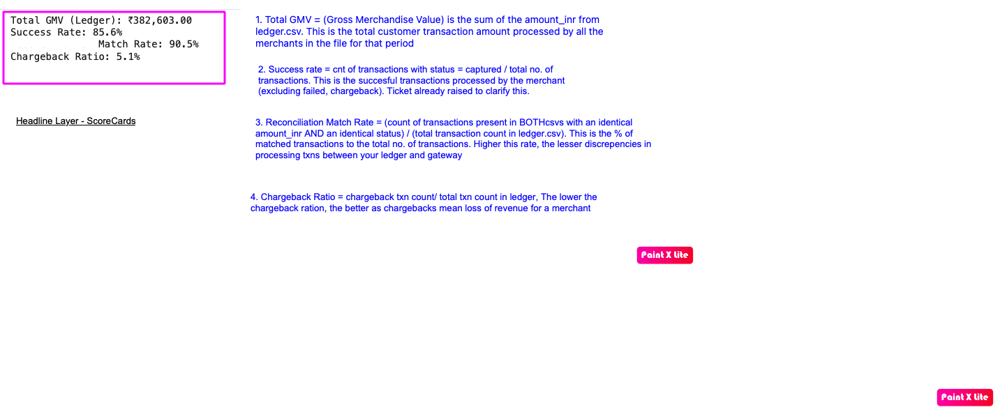
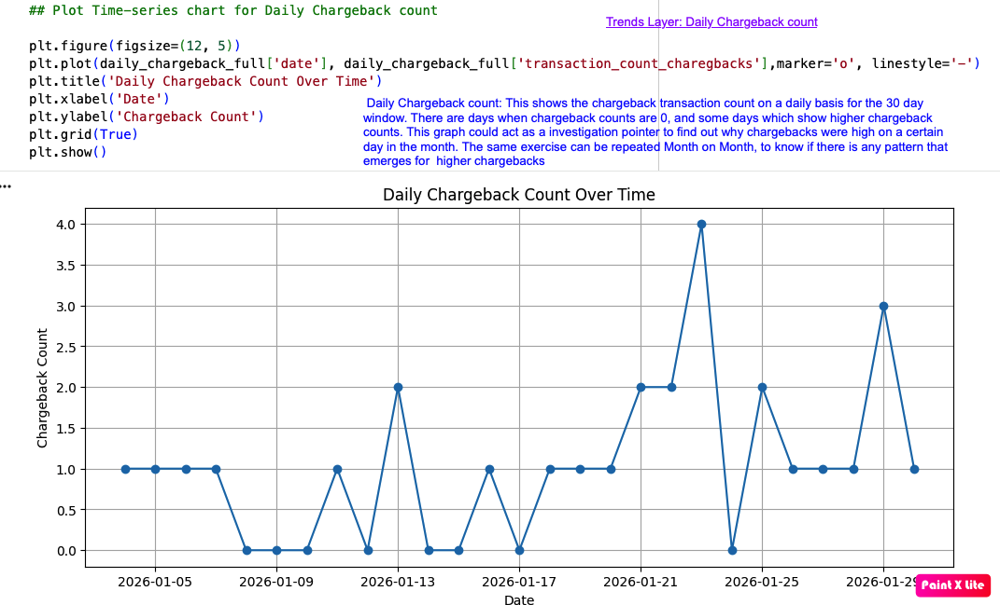
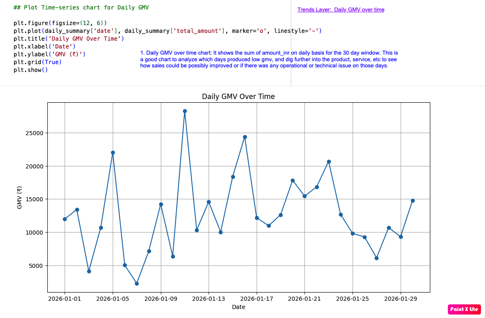
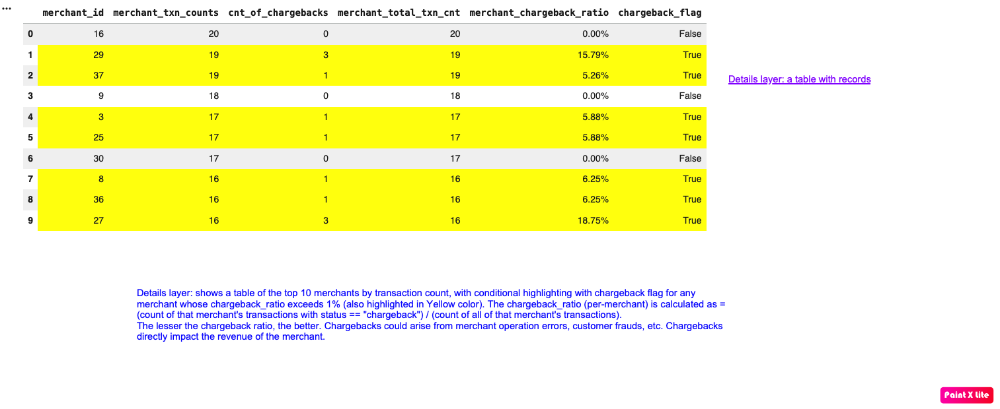
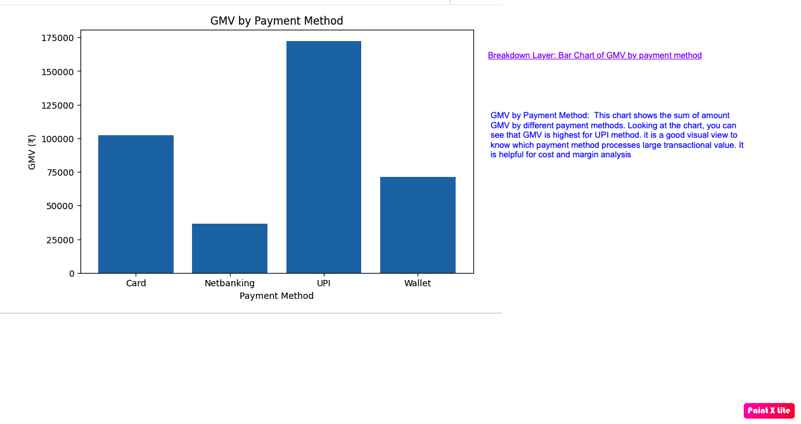

# Payments Fraud Analytics Dashboard

This dashboard provides a layered view of payment performance, reconciliation quality, chargebacks, and transaction mix. Each section combines a dashboard visual with a concise explanation of the metric or insight shown.

## Regenerating the Dashboard Plots

The plotting logic is available in [`dashboard.py`](dashboard.py). The script reads [`ledger.csv`](../data/ledger.csv), [`gateway_export.csv`](../data/gateway_export.csv), and [`merchants.csv`](../data/merchants.csv), then writes the generated chart PNGs to the [`screenshots`](screenshots/) directory.

### Setup

From the `payments_fraud_analytics` project root, optionally create and activate a virtual environment:

```bash
python3 -m venv .venv
source .venv/bin/activate
#Install the dependencies listed in [`requirements.txt`](../requirements.txt):
python3 -m pip install -r requirements.txt
#Run the dashboard script from the project root:
python3 dashboard/dashboard.py
```

Running the script overwrites these chart files with plots generated from the current CSV data:

- [`trends_layer_daily_gmv_over_time.png`](screenshots/trends_layer_daily_gmv_over_time.png)
- [`trends_layer_daily_chargeback_count.png`](screenshots/trends_layer_daily_chargeback_count.png)
- [`breakdown_layer_gmv_by_payment_method.png`](screenshots/breakdown_layer_gmv_by_payment_method.png)
- [`breakdown_layer_ gmv_by_merchant_category.png`](screenshots/breakdown_layer_%20gmv_by_merchant_category.png)


## 1. Headline Layer: Scorecards

The headline scorecards summarize the dashboard's primary performance indicators:

1. **Total GMV (Gross Merchandise Value)**  
   The sum of `amount_inr` in `ledger.csv`. It represents the total customer transaction value processed by all merchants during the period.

2. **Success Rate**  
   The number of transactions with `status = captured`, divided by the total number of transactions. It represents successfully processed merchant transactions and excludes failed and chargeback transactions. A clarification ticket has already been raised for this definition.

3. **Reconciliation Match Rate**  
   The number of transactions present in both CSV files with identical `amount_inr` and `status` values, divided by the total transaction count in `ledger.csv`. A higher rate indicates fewer processing discrepancies between the ledger and payment gateway.

4. **Chargeback Ratio**  
   The number of chargeback transactions divided by the total transaction count in the ledger. A lower ratio is preferable because chargebacks represent lost merchant revenue.

[](screenshots/Headline_layer_scorecards.png)

[Open the headline-layer scorecards PNG](screenshots/Headline_layer_scorecards.png)

## 2. Trends Layer

### Daily Chargeback Count

This chart shows the number of chargeback transactions per day across the 30-day window. Some days have no chargebacks, while others show higher counts. The chart can serve as an investigation pointer for identifying why chargebacks increased on particular days. Repeating the analysis month over month may reveal recurring chargeback patterns.

[](screenshots/trends_layer_daily_chargeback_count.png)

[Open the daily chargeback count PNG](screenshots/trends_layer_daily_chargeback_count.png)

### Daily GMV Over Time

This chart shows the daily sum of `amount_inr` across the 30-day window. It helps identify low-GMV days for further analysis by product or service and can highlight potential sales, operational, or technical issues.

[](screenshots/trends_layer_daily_gmv_over_time.png)

[Open the daily GMV over time PNG](screenshots/trends_layer_daily_gmv_over_time.png)

## 3. Details Layer: Top Merchants

This table shows the top 10 merchants by transaction count. Conditional formatting highlights merchants whose chargeback ratio exceeds 1%, including a yellow chargeback flag.

The per-merchant chargeback ratio is calculated as:

> **Chargeback ratio** = Merchant transactions with `status = chargeback` / All transactions for that merchant

A lower chargeback ratio is preferable. Chargebacks may arise from merchant operational errors, customer fraud, or other issues, and they directly reduce merchant revenue.

[](screenshots/details_layer_table.png)

[Open the details-layer table PNG](screenshots/details_layer_table.png)

## 4. Breakdown Layer

### GMV by Payment Method

This chart shows total GMV grouped by payment method. UPI has the highest GMV in the displayed period. The visual makes it easy to identify which payment methods process the greatest transaction value and can support cost and margin analysis.

[](screenshots/breakdown_layer_gmv_by_payment_method.png)

[Open the GMV by payment method PNG](screenshots/breakdown_layer_gmv_by_payment_method.png)

### GMV by Merchant Category

This chart shows total GMV grouped by merchant category. E-commerce has the highest GMV in the displayed period, followed by travel.

[](screenshots/breakdown_layer_%20gmv_by_merchant_category.png)

[Open the GMV by merchant category PNG](screenshots/breakdown_layer_%20gmv_by_merchant_category.png)
